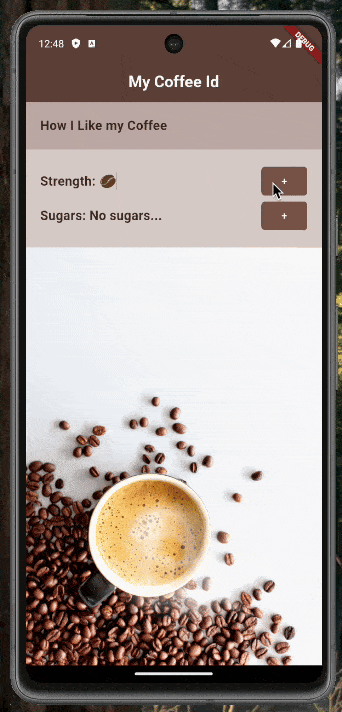

# Coffee Card - My First Flutter Project



## About the Project

This is my first Flutter project where I learned the fundamentals of Flutter development. The project is a coffee card application that demonstrates various Flutter concepts and best practices.

## What I Learned

- **Widget Creation**: Understanding and implementing various Flutter widgets to create a beautiful user interface
- **Styling**: Learning how to style widgets using Flutter's powerful styling system
- **State Management**: Implementing state management to handle dynamic data and user interactions
- **Asset Management**: Working with images and other assets in Flutter
- **Layout Design**: Creating responsive and visually appealing layouts

## Features

- Interactive coffee card interface
- Custom styling and animations
- Asset integration (coffee-related images)
- Responsive design

## Getting Started

### Prerequisites

- Flutter SDK (version 3.8.1 or higher)
- Dart SDK
- Android Studio / VS Code with Flutter extensions

### Installation

1. Clone the repository
```bash
git clone [your-repository-url]
```

2. Navigate to the project directory
```bash
cd coffee_card
```

3. Install dependencies
```bash
flutter pub get
```

4. Run the app
```bash
flutter run
```

## Project Structure

- `lib/` - Contains the main Dart code
- `assets/` - Contains images and other static assets
- `test/` - Contains test files
- `pubspec.yaml` - Project configuration and dependencies

## Dependencies

- Flutter SDK
- cupertino_icons: ^1.0.8
- flutter_lints: ^5.0.0

## Future Improvements

- Add more interactive features
- Implement user authentication
- Add coffee ordering functionality
- Enhance the UI with more animations

## Acknowledgments

- Net Ninja provided the code along for this project.
  - https://www.youtube.com/playlist?list=PL4cUxeGkcC9giLVXCHSQmWqlHc9BLXdVx
